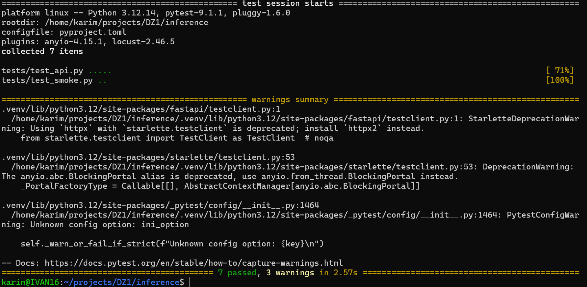
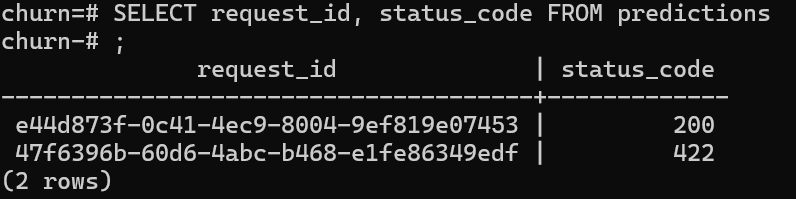
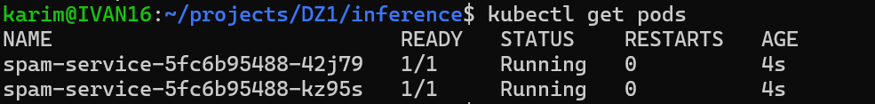
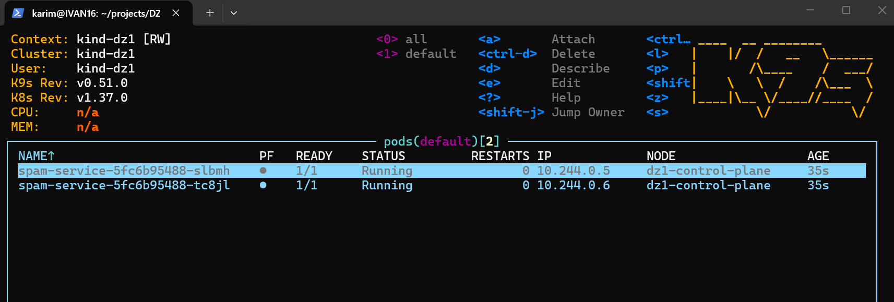
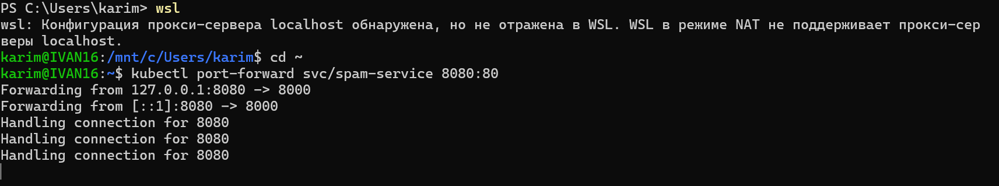
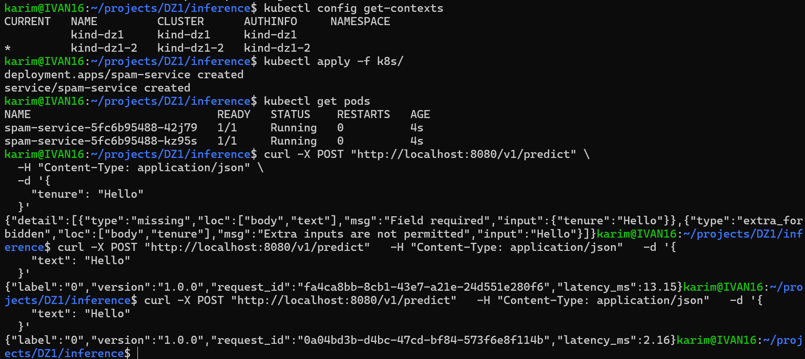
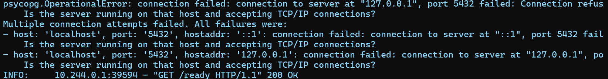
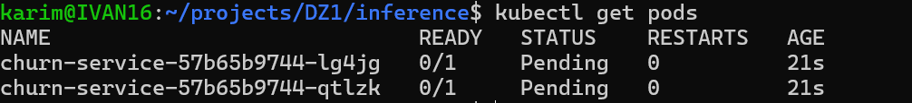

# ML Inference Service

# 1. Запуск проекта на чистой машине

Данный раздел содержит последовательность команд, необходимых для запуска и проверки проекта на чистой машине.

## 1.1. Запуск Docker Compose

Сначала необходимо собрать и запустить контейнеры проекта:

```bash
docker compose up -d --build
```

---

## 1.2. Запуск автоматических тестов

После запуска необходимых контейнеров выполнить автоматические тесты:

```bash
uv run pytest
```

Все тесты должны завершиться успешно.

---

## 1.3. Остановка Docker Compose

Перед запуском приложения в Kubernetes остановить контейнеры Docker Compose:

```bash
docker compose down
```

---

## 1.4. Создание Kubernetes-кластера

Создать локальный Kubernetes-кластер `kind`:

```bash
kind create cluster --name dz1
```

---

## 1.5. Загрузка Docker-образа в kind

Загрузить ранее собранный Docker-образ в кластер:

```bash
kind load docker-image spam-service:1.0 --name dz1
```

---

## 1.6. Запуск приложения в Kubernetes

Применить Kubernetes-манифесты:

```bash
kubectl apply -f k8s/
```

---

## 1.7. Проверка запуска Deployment

Проверить состояние pod'ов:

```bash
kubectl get pods
```

После успешного запуска должны быть доступны две реплики приложения.

---
# Отчёт

## 1. Проверка автоматических тестов

Для проверки корректности работы API были написаны автоматические тесты с использованием `pytest` и `FastAPI TestClient`.

Тестами проверяются:

* успешный запрос к `/v1/predict`;
* валидация входных данных;
* обработка некорректных значений;
* наличие лишних полей в запросе;
* корректная обработка `None` в соответствующих полях.

Все тесты успешно пройдены.

**Скриншот выполнения `pytest`:**



---

## 2. Проверка записи предсказаний в PostgreSQL

После выполнения запросов к `/v1/predict` информация о предсказаниях сохраняется в PostgreSQL.

Для проверки корректности записи была выполнена выборка из таблицы с логами предсказаний.

Использованный запрос:

```sql
SELECT request_id, status_code
FROM predictions;
```

**Скриншот результата выполнения запроса:**



По результатам проверки записи о выполненных предсказаниях присутствуют в базе данных.

---

## 3. Развёртывание приложения в Kubernetes

Для развёртывания приложения был создан локальный Kubernetes-кластер с использованием `kind`.

Kubernetes Deployment содержит **две реплики** приложения, что позволяет одновременно запускать два экземпляра inference-сервиса.

Для приложения настроены следующие проверки состояния:

* **startup probe** — проверяет успешный запуск приложения;
* **readiness probe** — определяет, готов ли Pod принимать запросы;
* **liveness probe** — контролирует состояние работающего приложения.

Также для контейнера заданы `requests` и `limits` по вычислительным ресурсам.

После применения манифестов было выполнено ожидание успешного завершения rollout.

Проверка состояния Pod'ов:

```bash
kubectl get pods
```

**Скриншот:**



---

## 4. Проверка Kubernetes через k9s

Для дополнительной проверки состояния кластера использовался `k9s`.

В интерфейсе были проверены запущенные Pod'ы и их состояние.

**Скриншот k9s:**



На скриншоте должно быть видно, что Pod'ы находятся в рабочем состоянии.

---

## 5. Проверка API через Kubernetes Service

Для доступа к приложению извне Kubernetes-кластера использовался `kubectl port-forward`.

После проброса порта были проверены endpoint'ы:

* `/health`;
* `/ready`;
* `/v1/predict`.

Запрос к `/v1/predict` вернул корректный результат предсказания модели.

**Скриншот запроса и ответа:**





---

## 6. Журнал проблем

В процессе выполнения работы возникло несколько проблем:

### 6.1. PostgreSQL недоступен

При POST-запросе к pod возникала ошибка:



Причина заключалась в том, что при написании сервиса я захардкодил db_url, чтобы проверить её работу локально и эта версия образа и была загружена в кластер. При это сам POST-запрос проходил, так как добавление логов в db просиходило фоновым процессом, и сам pod не падал, падала только обработка этого SQL-запроса.

**Исправление:**

Изменил образ, убрав оттуда захардкоженный url

### 6.2. Pods Pending

Также возникала ошибка, из-за которой не получалось поднять pods:



Проблема была связано с ошибкой в манифесте, где я неправильно указал образ. После исправления pods стали подниматься, однако сразу падали (CrashLoopBackOff), это было связано с неправильно расставленными ресурсами в манифесте (падали из-за ошибки OOM)

**Исправление:**

Изменение манифеста

После изменения прав приложение смогло создавать необходимые объекты и записывать данные в PostgreSQL.

### 6.3. Проблемы с базой данных / пользователем

На этапе первоначальной настройки PostgreSQL также возникали ошибки отсутствующей базы данных и роли, например:

```text
database "..." does not exist
```

и

```text
role "..." does not exist
```

Проблема была решена созданием необходимых объектов PostgreSQL и настройкой параметров подключения приложения.

---

## 8. Итог

В рамках работы был реализован и проверен inference-сервис с HTTP API.

Были выполнены:

* автоматическое тестирование API;
* сохранение результатов предсказаний в PostgreSQL;
* контейнеризация приложения;
* развёртывание двух реплик в Kubernetes;
* настройка startup, readiness и liveness probes;
* настройка requests и limits;
* проверка состояния приложения через `kubectl` и `k9s`;
* проверка API через Kubernetes Service и `port-forward`;
* нагрузочное тестирование с использованием Locust.

По результатам проверки приложение успешно запускается, проходит автоматические тесты и доступно через Kubernetes Service.


