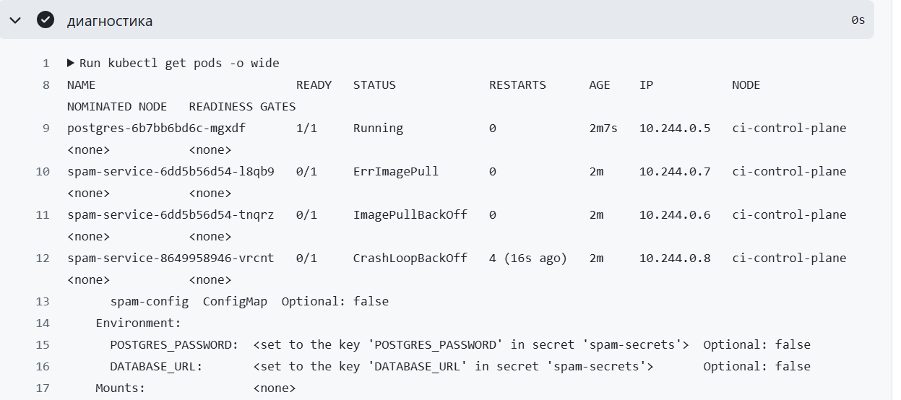
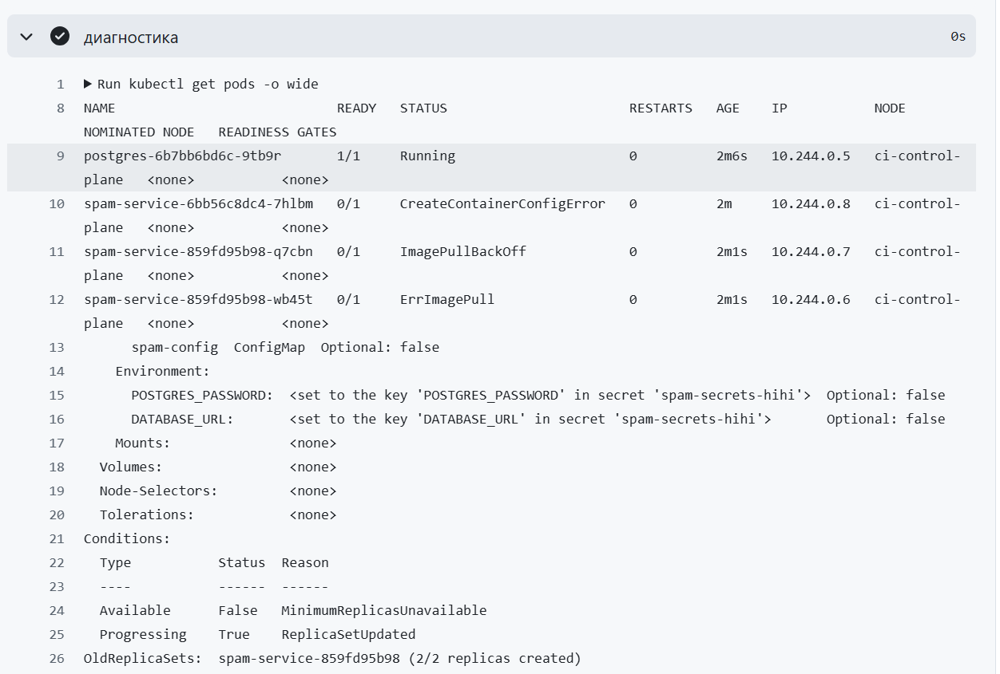
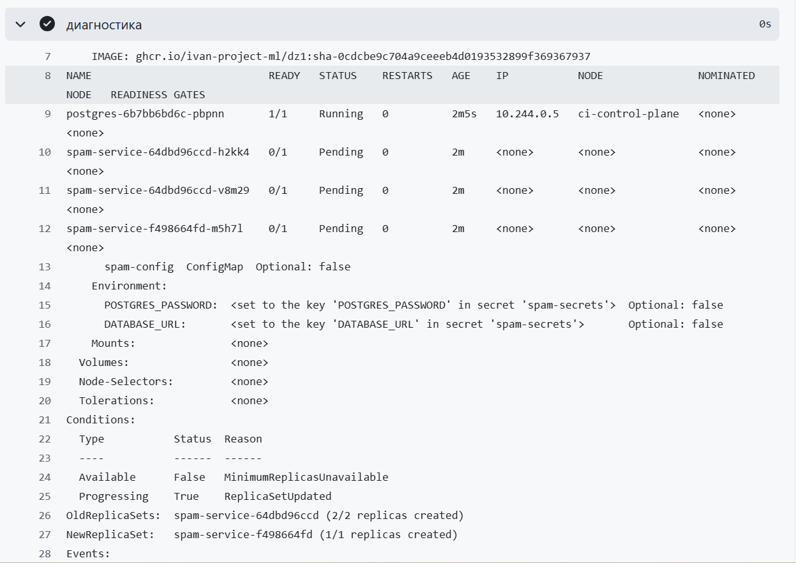
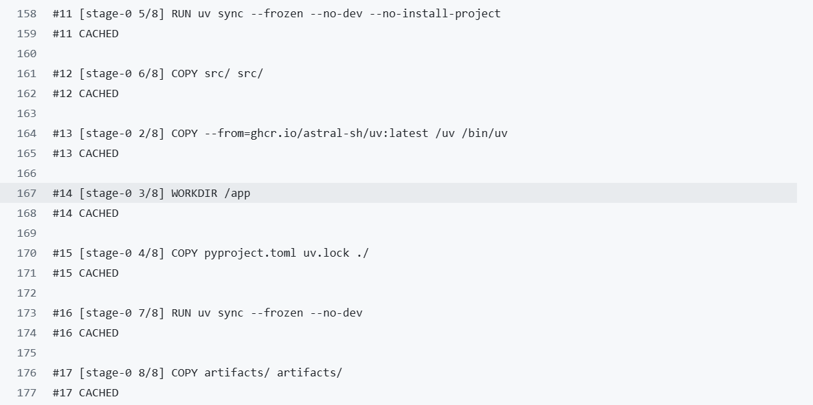

# Домашка 2. CI/CD для spam-service

Репозиторий: https://github.com/ivan-project-ml/DZ1

Комментарий: часть коммитов выполнены с другого аккаунта, потому что данный аккаунт у меня специально для проектов, а ivankarimov - мой основной

---

## 1. Таблица «пункт задания, ссылка или скрин»

| Пункт | Что предъявляем | Ссылка / скрин |
|---|---|---|
| 2.1 Пайплайн | Зелёный прогон со всеми тремя job | https://github.com/ivan-project-ml/DZ1/actions/runs/36445173738 - ссылка на прогон с 3 зелёными job |
| 2.1 Пайплайн | Страница пакета в GHCR | https://github.com/ivan-project-ml/DZ1/pkgs/container/dz1 |
| 2.2 Процесс | PR с красным и затем зелёным прогоном | https://github.com/ivan-project-ml/DZ1/pull/6 |
| 2.3 Поломка 1 (конфиг) | Красный прогон | https://github.com/ivan-project-ml/DZ1/actions/runs/36451035258 |
| 2.3 Поломка 1 (конфиг) | Зелёный после починки | https://github.com/ivan-project-ml/DZ1/actions/runs/36452056426 |
| 2.3 Поломка 2 (секрет) | Красный прогон | https://github.com/ivan-project-ml/DZ1/actions/runs/36452683452 |
| 2.3 Поломка 2 (секрет) | Зелёный после починки | https://github.com/ivan-project-ml/DZ1/actions/runs/36453632053 |
| 2.3 Поломка 3 (ресурсы) | Красный прогон | https://github.com/ivan-project-ml/DZ1/actions/runs/36454221550 |
| 2.3 Поломка 3 (ресурсы) | Зелёный после починки | https://github.com/ivan-project-ml/DZ1/actions/runs/36455018064 |

---

## 2. Три красных прогона с диагнозом (пункт 2.3)

### Поломка 1. Конфиг (несуществующий `MODEL_PATH` в ConfigMap)

- Красный job: `deploy`
- Красный шаг: сервис
- Статус пода: CrashLoopBackOff
- Что напечатал шаг диагностики: 
- Как понять причину по логу, не глядя в diff: глядя на текст ошибки FileNotFoundError: [Errno 2] No such file or directory: 'artifacts/model-new-ehehehe.joblib' становится понятно, что приложение не нашло путь к модели из переменной окружения. Конфиг подключён, значит необходимо искать ошибку в его значениях

### Поломка 2. Секрет (имя в `secretKeyRef` не совпало)

- Красный job: `deploy`
- Красный шаг: сервис
- Статус пода: CreateContainerConfigError
- Что напечатал шаг диагностики: 
- Как понять причину по логу: лог Error from server (BadRequest): container "api" in pod "spam-service-859fd95b98-q7cbn" is waiting to start: trying and failing to pull image и состояние контейнера CreateContainerConfigError прямо означает проблему с конфигурацией контейнера при старте

### Поломка 3. Ресурсы (`requests.memory` заведомо больше, чем есть на узле)

- Красный job: `deploy`
- Красный шаг: сервис
- Статус пода: Pending
- Что напечатал шаг диагностики: 
- Как понять причину по логу: в данном случае по логам причину можно установить частично: сам факт, что все три пода Pending и у них нет NODE/IP, уже указывает, что под не назначен ни на один узел. То есть можно исключить проблемы с образом, секретами и кодом приложения — они просто не успевают проявиться.

---

## 3. Семь вопросов

### Вопрос 1. Время job `build` в первом и втором прогоне, кэшированный слой

- Первый прогон (с холодным кэшем): 60 секунд, https://github.com/ivan-project-ml/DZ1/actions/runs/36438336789
- Второй прогон (с кэшированными слоями): 16 секунд, https://github.com/ivan-project-ml/DZ1/actions/runs/36448029298/job/109015531166
- Какой слой взят из кэша и почему именно он: 
Не менялись именно эти слои слои, потому что файлы, от которых они зависят не изменялись между прогонами (взят первый прогон и прогон после починки integration test)

### Вопрос 2. Поды в `ImagePullBackOff` при зелёном прогоне

kubectl apply -f k8s/ создаёт под с образом spam-service:1.0 из манифеста, такого образа нигде нет, под уходит в ImagePullBackOff в первые секунды; затем kubectl set image меняет образ на реальный (ghcr.io/...:sha-...), уже загруженный в kind, и именно на этот новый под ссылается rollout status — поэтому итоговый статус зелёный, а старые поды со старым образом просто удаляются.

### Вопрос 3. Путь пароля БД от настроек GitHub до переменной в поде

В github создаём Secrets, после этого в ci.yaml мы подтягиваем секрет ${{ secrets.DB_PASSWORD }}. Далее создаём kubernetes-secret, здесь значение переменной DB_PASSWORD записывается уже внутрь кластера kind, как объект Secret с именем spam-secrets. Далее мы подключаем секрет к поду в deployment и прокидываем в контейнер. Конфиг для этого использовать нельзя, потому что потому что ConfigMap хранится в открытом виде и в репозитории, и в кластере (в отличие от Secret, который хотя бы не лежит в git).

### Вопрос 4. Что будет без `needs: tests` у job `build`

если убрать needs: tests, build может запуститься параллельно с tests или даже раньше; если тесты красные, но build всё равно соберёт образ и запушит его в GHCR, а deploy его выкатит — в проде окажется код с известным багом, хотя CI формально «работал»

### Вопрос 5. Почему на PR бегут только тесты

За это отвечает строка `if: github.ref == 'refs/heads/main'` в job `build` . Это сделано чтобы из чужого/непроверенного PR нельзя было случайно (или намеренно) опубликовать образ в ваш GHCR и выкатить его — до мержа в main собирать и выкатывать нет смысла.

### Вопрос 6. Зачем `pg_advisory_xact_lock` в `init()`

pg_advisory_xact_lock блокирует бд на время транзакции. Без неё при двух репликах и пустой базе начнётся "гонка" за одновременное создание схемы: оба видят, что таблицы ещё нет, оба одновременно пытаются её создать, и один из двух падает с ошибкой. Речь идёт о репликах пода spam-service

### Вопрос 7. Статусы подов из трёх поломок по порядку жизни пода

Pending (на стадии назначения пода на узел) → CreateContainerConfigError (на стадии подготовки конфигурации контейнера) → CrashLoopBackOff (на стадии запуска процесса приложения)

---

## 4. Журнал проблем

### Проблема 1. Workflow не запускался — папка без точки

- Что не получилось: PR смержился в main, но в Actions вкладке workflow "ci" вообще не появился, тесты физически не запускались.
- Текст ошибки: явной ошибки не было — просто отсутствие workflow в списке.
- Как нашли причину: Перепроверил структуру проекта и название папок.
- Как починили: перенесли файл в `.github/workflows/ci.yaml` (`git mv`), закоммитили в отдельной ветке `fix-ci` и открыли новый PR.

### Проблема 2. Дубликат папок `.github/workflow` и `.github/workflows`

- Что не получилось: в процессе переноса в ветке `fix-ci` возникли одновременно `.github/workflow` (без `s`) и `.github/workflows` (с `s`) с копиями `ci.yaml` в обеих.
- Текст ошибки: не ошибка, а путаница в структуре — риск, что GitHub запустит два прогона или найдёт битый файл.
- Как нашли причину: визуально через `ls -R .github` и `git status`.
- Как починили: оставили только `.github/workflows/ci.yaml`, лишнюю папку `.github/workflow` удалили (`rm -r` / `git rm -r`).

### Проблема 3. Workflow оказался во вложенной папке `inference/.github/...`

- Что не получилось: даже после исправления пути workflow не запускался, потому что весь проект (включая `.github`) лежал внутри подпапки `inference/`, а не в корне репозитория.
- Текст ошибки: workflow снова не подхватывался; после переноса в корень — job `tests` не находил `pyproject.toml`, `Dockerfile` и `k8s/`, так как искал их от корня репозитория.
- Как нашли причину: командой `git ls-tree -r HEAD --name-only` увидели, что весь код лежит под `inference/`.
- Как починили: подняли `ci.yaml` в `.github/workflows/` в корне репозитория; в самом workflow добавили `working-directory: inference` для job `tests`, `context: inference` для `docker build`, и путь `inference/k8s/` для `kubectl apply`.

### Проблема 4. `EXE002` — исполняемый бит на .py файлах

- Что не получилось: `ruff check` в CI падал на пяти файлах (`__init__.py`, `config.py`, `db.py` и др.) с ошибкой про отсутствующий shebang, при этом локально `ruff check` в WSL проблем не показывал.
- Текст ошибки: `EXE002 The file is executable but no shebang is present`.
- Как нашли причину: командой `git ls-tree -r HEAD src` увидели у этих файлов режим `100755` вместо `100644`; `ls -l` на диске в WSL подтвердил тот же бит (`-rwxr-xr-x`). Отдельно проверили `uv run ruff check --select EXE .` локально — правило не сработало, из чего сделали вывод, что ruff под WSL не проверяет группу `EXE*`, полагаясь на недоверие к правам файловой системы, поэтому расхождение с CI (обычный Linux-раннер) не было видно заранее.
- Как починили: сняли исполняемый бит командой `chmod 644` для всех `.py` файлов, закоммитили изменение режима (`git diff --cached --summary` показал `mode change 100755 => 100644`).
